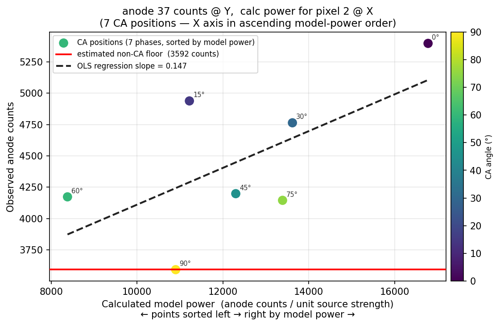

# Gamma Reconstruction — Model-Driven Approach

> **Model diagnostic figures** — run `python visualise_pixel.py --pixel <IDX>` to
> regenerate Figures 1 and 2 for any pixel in the source grid (0 – pixel_count−1).
> Example: `python visualise_pixel.py --pixel 2 --anode 37 --output-prefix readme`
>
> **Metric comparison figures** — run `python visualise_metrics.py` to regenerate
> `metrics_fig2` through `metrics_fig5` referenced in the second half of this document.

---

## Camera Design and the 6×6 Problem

The detector grid and coded-aperture (CA) mask are similarly sized, so at 36 of the
possible source positions the CA shadow falls grid-on-grid onto the detector. Every
image reconstruction technique tried so far finds peaks at those 36 positions — the
physics forces them there regardless of algorithm. This makes the camera effectively a
6×6-pixel device in the absence of any countermeasure.

The **multiple-CA-position technique** breaks the grid-on-grid association by rotating
the CA mask through several angular positions before each acquisition frame. This
introduces part-anode shadows that carry sub-grid spatial information, enabling an
effective pixel count well beyond 6×6.

---

## The Model

The reconstruction model translates detector anode counts into a 70×70 gamma image.
Each pixel in that image represents a 3D vector radiating from the camera — if a
radioactive source exists anywhere along that vector, it should appear at the
corresponding pixel position. The image plane is fixed at a chosen
camera-to-image-plane distance.

For each of the 1 225 candidate positions in the 35×35 source grid the model
pre-calculates, for every anode and every CA rotation angle, the **expected anode
power** (the share of counts that would arrive at that anode via the CA if a source of
unit strength were located on that pixel's 3D vector). After scoring, the 35×35 score
map is cubic-spline up-sampled to a 70×70 output image. Comparing model predictions
against the measured anode counts is how the camera decides whether — and how strongly
— a source is present at each candidate position.

---

## Scoring a Single Pixel: the Per-Anode View

For each candidate pixel the model evaluates one (model\_power, observed\_count) pair
per anode per CA rotation.  The chart below shows **anode 37** across the 7 CA
positions for **pixel 2** in the 35×35 source grid — the anode with the strongest
positive via-CA response at this pixel.


*Figure 1 — Anode 37 counts (Y axis) plotted against the calculated model power for
pixel 2 (X axis) at each of the 7 CA positions. Each point is colour-coded by CA
rotation angle. The red horizontal line estimates the non-CA count floor — photons
reaching this anode by paths that do not pass through the CA (scatter, background,
direct leakage). The dashed OLS line shows the positive slope: observed counts rise
with model power, indicating source activity on the 3D vector for pixel 2. A flat or
negative relationship would indicate no source at that pixel.*

> **Regenerate for any pixel:** `python visualise_pixel.py --pixel <IDX>`
> The script auto-selects the anode with the strongest positive slope.

### What the slope means

The **slope** of the relationship between model power and observed counts is the key
quantity.  Because the CA modulates how many counts arrive at each anode as a function
of rotation angle, the slope can only be non-zero if via-CA gamma rays are present.
The Y-intercept (the non-CA floor) is irrelevant — it reflects background radiation
and direct leakage that are the same regardless of source position.

In a fully calibrated detector the via-CA slope should be **identical for all 64
anodes** for the same pixel, even though each anode has its own non-CA floor.

---

## Combining All Anodes: the Central Visualisation

Because all anodes share the same via-CA slope for a given pixel, the data from all 64
anodes can be overlaid on a single plot.  This gives **7 CA positions × 64 anodes =
448 (model power, observed count) pairs** for each candidate pixel, from which a
single regression slope is derived.


*Figure 2 — All 64 anodes × 7 CA positions plotted together for pixel 2 (observed
anode counts on Y, calculated model power on X). Each anode contributes a cluster of 7
points, offset vertically from other anodes by its own non-CA floor. The dotted line is
the single least-squares regression slope fitted across the entire 448-point dataset —
ignoring per-anode Y-offsets because they are nuisance parameters. A positive slope
(as shown here) indicates source activity on this pixel's 3D vector; a near-zero or
negative slope indicates no source. Repeating this score for all 1 225 pixels and
up-sampling the resulting slope map produces the reconstructed gamma image.*

The scatter is large because each anode carries its own non-CA floor (Y-offset), but
since all anodes share the same via-CA slope the regression is still well determined.
Pooling evidence from all 64 anodes into a single slope score is why the multi-anode
approach improves localisation compared with using any single anode's correlation.

---

## Choosing the Figure of Merit

The scatter plot above is a useful conceptual illustration: if a source is present on
pixel *p*'s 3D vector, observed counts should be high wherever the model predicts high
power, giving a positive slope.  The *ideal* score for pixel *p* would be an OLS
regression that fits one common slope across all 64 anodes while absorbing each anode's
independent background floor (non-CA floor) as its own intercept — a fixed-effects
model.

The code implements a simpler approximation: it builds a single length-448 vector of
all (model\_power, observed\_count) pairs and applies a similarity metric to the two
vectors **as-is**, without profiling out the 64 per-anode background floors.  This
means the per-anode Y-offsets are included in the comparison, which can reduce
sensitivity relative to a true fixed-effects slope.  The choice of FOM determines both
how well the background contamination is suppressed and how robust the score is to
noise.

For each candidate pixel the code builds two vectors of length
**n\_channels × n\_phases = 64 × 7 = 448**.  For every detector channel and every
active CA phase the model-predicted count is placed at index
`logical_channel × n_phases + phase_offset`; the corresponding measured count
goes to the same index in the observed vector.  The chosen FOM is then applied to
these two length-448 vectors.  The pixel whose model best matches the observation
receives the highest score; the 35×35 score map is cubic-spline up-sampled to the
70×70 output image.

---

## Why Pearson Correlation Is Not Ideal

The Pearson correlation coefficient was the original FOM.  It is defined as:

```
r = cov(O, M) / (σ_O · σ_M)
```

where O is the observed vector and M is the model prediction vector.  While familiar
and easy to compute, it has several properties that make it a poor choice here.


*Figure 3 — What Pearson actually operates on vs what Cosine operates on. For a
flat/uniform pair (right column), mean-subtraction leaves only noise, making std(M) = 0
so Pearson returns 0 even though the shapes agree perfectly. Cosine correctly
returns 1.0.*

### 1. Mean-subtraction distorts sparse or imbalanced phase data

Pearson centres both vectors around their respective means before computing the inner
product.  In coded-aperture gamma imaging the observed counts per phase vary
substantially — some rotation angles place the CA mask over high-sensitivity detector
elements and others do not.  Mean-subtraction can flip the sign of low-count phases
(making a phase with genuinely few counts appear as a *negative* contribution) and can
inflate the apparent agreement between a model that predicts near-zero counts for some
phases and an observation that also has near-zero counts, when what has actually been
measured is just background noise.

### 2. Incorrect noise model

Photon detection is a counting process governed by Poisson statistics: the variance of
a count is equal to its expected value, not a fixed constant.  Pearson implicitly
assumes Gaussian errors with *uniform* variance (ordinary least-squares geometry in
the normalised space).  This mismatch means high-count bins and low-count bins are
treated as equally reliable, even though high-count bins carry proportionally more
statistical information.  Rare but large fluctuations in low-count channels therefore
disproportionately affect the score.

### 3. Scale invariance is inappropriate here

Pearson is invariant to multiplicative rescaling of either vector.  In practice this
means a model predicting a uniform, featureless count distribution can score highly
against an observed vector that is also approximately uniform, even though no useful
shape information has been matched — Pearson can mistake *flat* agreement for
*structured* agreement.

### 4. Sensitivity to outliers


*Figure 4 — Synthetic all-anodes × all-CA-phases scatter (64 anodes × 7 phases = 448
points, per-anode floors, shared via-CA slope).  Left: clean scatter.  Middle: ten
lowest-model-power points each spiked by +6 000 counts — the OLS slope is pulled from
0.118 to 0.094 and the crimson stars are visibly above the trend.  Right: normalised
score vs spike size (1.0 = clean baseline).  Cosine is the most robust; Spearman
degrades more slowly than Pearson; Poisson is the most sensitive.*

A detector channel with an anomalously high count — due to a cosmic-ray event or
electronic noise — inflates the variance term in Pearson's denominator, dragging down
the correlation for otherwise well-matched vectors.  Because the spiked points have low
model power (left side of the scatter), they create large rank mismatches that also
hurt Spearman, but less severely.  Cosine similarity is least affected because the
dominant L2 norm is spread across all 448 components and a handful of outliers barely
rotate the observed-vector direction.

---

## Alternative Metrics

Three alternative figures of merit are implemented, selectable via
`--reconstruction-metric`.

### Cosine Similarity (`--reconstruction-metric cosine`)

```
cos(O, M) = (O · M) / (‖O‖ · ‖M‖)
```

Cosine similarity is the **normalised dot product** — equivalently, the dot product of
the two unit vectors:

```
cos(O, M) = (O/‖O‖) · (M/‖M‖)
```

Geometrically this is the **projection of the observation's direction vector onto the
model's direction vector**.  Both vectors live in the $ \(8 \times 8 \times 7 = 448\) $-
dimensional count space (64 anodes × 7 CA phases).  For each candidate pixel in the
35×35 source grid the model supplies a pre-computed direction vector
$\(\hat{M} = M/‖M‖\);$ cosine similarity asks how closely the current shadowgram points
in that same direction — 1 meaning perfect alignment (source present), 0 meaning
orthogonal (source absent).

For strictly non-negative count data the result lies in $\([0, 1]\)$, making it
straightforward to interpret.  Crucially it **does not subtract the mean**, so the
full raw flux distribution across all phases contributes directly.

**Why it improves on Pearson:**

- No mean-subtraction.  Phases with genuinely high counts contribute a large dot-product
  term; phases with near-zero counts contribute near zero.  The metric therefore directly
  rewards matching the *flux distribution shape* across phases, which is precisely what
  localises the source.
- Naturally scale-invariant (via \(\ell_2\) normalisation) in a way that preserves the
  relative phase structure, unlike Pearson's mean-centred normalisation.
- Robust against overall count-rate offsets (e.g., changes in source activity between
  acquisition segments).

**Limitation:** Like Pearson, it does not respect the Poisson variance structure — all
channels are weighted equally regardless of their statistical uncertainty.

---

### Spearman Rank Correlation (`--reconstruction-metric spearman`)

Spearman rank correlation \(\rho\) is computed by replacing each element of both vectors
with its rank within that vector, and then computing Pearson correlation on the
rank-transformed values.

**Why it improves on Pearson:**

- **Outlier robustness.**  An anomalously large channel value is mapped to a high rank,
  so its magnitude no longer dominates the calculation.  When the outlier also has low
  model power (low X rank) the rank mismatch is still penalised, but less severely than
  Pearson's variance-inflation effect — see Figure 4 right panel.
- **Monotone rather than strictly linear agreement.**  The reconstruction quality relies
  on the phases being ordered by count rate in a way that mirrors the model prediction;
  Spearman captures this ordering faithfully even when the relationship is non-linear
  (e.g., due to detector saturation or non-uniform flat-field corrections).
- Retains a familiar \([-1, 1]\) range and zero-under-independence interpretation.

**Limitation:** Rank transformation loses absolute count magnitude information.  Two
candidate positions whose models predict different *amounts* of flux modulation but the
same rank ordering will receive identical Spearman scores.

---

### Profile Poisson Log-Likelihood (`--reconstruction-metric poisson`)


*Figure 5 — Poisson count distributions at three intensity levels. The Poisson-correct
±1σ band (purple) scales with √λ. Pearson's implicit uniform error band (red) is far
too wide at low counts (under-weighting precise measurements) and too narrow at high
counts (over-weighting noisy ones).*

This is the statistically optimal figure of merit for photon-counting data.

The Poisson likelihood for observing counts \(O_i\) when the expected count is
\(\lambda_i\) is:

```
L = ∏_i  exp(−λ_i) · λ_i^{O_i} / O_i!
```

The model prediction for pixel position \(p\) gives expected counts proportional to
\(M_i\).  Because the absolute source intensity is unknown, a single scale factor
\(\alpha\) is introduced: \(\lambda_i = \alpha M_i\).  The maximum-likelihood value of
\(\alpha\) is:

```
α̂ = Σ O_i / Σ M_i
```

Substituting back into the log-likelihood yields the **profile log-likelihood**:

```
ll_profile = Σ_i [ O_i · log(α̂ M_i) − α̂ M_i ]
```

which depends only on the *shape* of the model vector, not its overall normalisation.
The score stored in the reconstruction image is this quantity divided by the number of
valid terms (so that images accumulated over different numbers of active phases remain
comparable).

**Why this is more optimal than Pearson:**

- **Correct noise model.**  The score is derived directly from the Poisson probability
  of the observed data given the model shape.  Bins with high expected counts contribute
  proportionally more to the score, correctly reflecting their greater statistical weight.
- **Scale-free by construction.**  The unknown source intensity is profiled out
  analytically, with no need to normalise both vectors post-hoc.
- **Sensitivity to shape, not offset.**  The log term `O_i · log(λ_i)` rewards having
  the model concentrate predicted counts where observed counts are high; the `−λ_i`
  penalty discourages over-predicting empty channels.
- **Asymptotically efficient.**  Among all unbiased statistics, the likelihood-ratio test
  (of which this is a component) achieves the minimum possible variance in the
  large-sample limit (Cramér–Rao bound).

**Limitation:** The score is in log-likelihood units, which are not bounded to \([0, 1]\)
or \([-1, 1]\), so the reconstructed image values are less immediately interpretable
without normalisation.  The metric also requires \(\lambda_i > 0\) (channels where the
model predicts zero counts are excluded from the sum).

---


*Figure 6 — Score vs source-position offset from the true location (toy 1D model,
Poisson-noisy observation). The narrower the peak the more precisely the metric can
localise the source. FWHM bars (right) give a quantitative summary; the metric with
the lowest FWHM is highlighted.*

## Metric Comparison Summary

| Property | Pearson | Cosine | Spearman | Poisson |
|---|---|---|---|---|
| Mean-subtracted | Yes | No | Yes (ranks) | No |
| Correct noise model (Poisson) | No | No | No | Yes |
| Outlier robust | No | Moderate | Yes | Moderate |
| Scale-invariant | Yes | Yes | Yes | Yes (profiled) |
| Bounded output | \([-1,1]\) | \([0,1]\) | \([-1,1]\) | Unbounded |
| Optimal for count data | No | No | No | Yes |

The current default is `cosine`.  For data with well-calibrated flat-field corrections
and sufficient statistics per phase, `poisson` is expected to give the best source
localisation because it is the only metric derived from the true generative model of
the data.  `spearman` is recommended when detector noise or occasional high-count
outliers are suspected.  `pearson` is retained for reproducibility comparisons with
prior results only.
